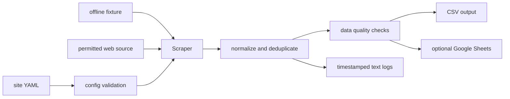

# Web-to-Sheets Case Study

## Problem and solution

Repeatedly copying structured web data into spreadsheets is slow and error-prone. This CLI reads YAML extraction rules, applies rate limits and validation, deduplicates records, writes CSV output, and can publish to Google Sheets when credentials are supplied.

## Architecture



## Trade-offs

- YAML rules avoid per-site code for simple pages but cannot model every JavaScript-heavy site.
- Offline fixtures make tests reproducible but do not cover live anti-bot or layout changes.
- Google Sheets is convenient for small workflows, not a substitute for a large analytical database.

## Measured validation

- Ruff passed and 22 pytest tests passed in 1.19 seconds on 2026-07-12.
- The offline fixture contains 10 quote records and requires no network or credentials.

## Limitations and failure modes

- Selector changes can reduce extracted rows or break validation.
- Robots rules, rate limits, and site terms must be checked for every live source.
- Sheets quotas and authentication failures can interrupt delivery after extraction.

## Reproduce

```bash
./scripts/bootstrap.sh
./scripts/run_demo.sh
wc -l out/quotes.csv
```

## Delivery recovery update — 5 September 2026

Fixed premature deduplication checkpoints and repeated rows within one batch. Live delivery now checkpoints only after the Sheets adapter confirms the append; failed uploads remain retryable. Added seven regression cases; all 29 tests and Ruff pass locally. See the [runbook](ops.md) for the remaining ambiguous-acknowledgement and concurrent-worker limits.
